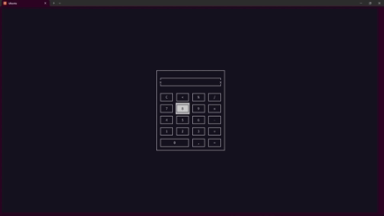

# 🧮 Calculadora Interativa - Linguagem C

Calculadora moderna e robusta com interface gráfica baseada em terminal usando a biblioteca NCurses.

[🇺🇸 English Version](README.md) | [🇧🇷 Versão em Português](PT-BR-README.md)


<br>

<p align="center">
  <!-- Adicione sua imagem de preview do projeto abaixo -->
  
</p>

<br>

## 📋 Índice

* [Sobre](#-sobre)
* [Tecnologias Utilizadas](#-tecnologias-utilizadas)
* [Como Executar](#-como-executar)
* [Licença](#-licença)
* [Contato](#-contato)

<br>

## 📖 Sobre

**Calculadora Interativa em C** é uma aplicação de calculadora baseada em terminal desenvolvida como parte de um projeto de disciplina universitária. Possui uma interface de usuário interativa implementada usando a biblioteca NCurses, proporcionando uma experiência de calculadora gráfica no ambiente de terminal.

**Principais recursos:**
*   **Interface Gráfica (NCurses):** Interface interativa de terminal com botões visuais e display.
*   **Operações Matemáticas:** Soma, subtração, multiplicação e divisão.
*   **Controle de Entrada do Usuário:** Manipulação de eventos de teclado para interação.
*   **Validação de Entrada:** Garante validade das operações e previne erros.
*   **Gerenciamento de Tela:** Funcionalidade de limpar tela e apagar último caractere.
*   **Estrutura Modular:** Código bem organizado com funções específicas para diferentes aspectos.
*   **Gerenciamento de Memória:** Alocação dinâmica de memória e manipulação de strings.

<br>

## 💻 Tecnologias Utilizadas

- Linguagem de Programação C
- Biblioteca NCurses
- Terminal Linux
- Alocação Dinâmica de Memória
- Manipulação de Strings

<br>

## 🛡️ Robustez e Boas Práticas

- O sistema utiliza alocação dinâmica de memória para gerenciar strings e dados.
- Validação de entrada para garantir operações matemáticas válidas.
- Tratamento de erros para falhas de alocação de memória.
- Interface modular com funções específicas para diferentes funcionalidades.
- Suporte a cores no terminal quando disponível.

## 🚀 Como Executar

```bash
# Clone este repositório
$ git clone https://github.com/gabrielcamarate/Calculadora-Interativa.git

# Entre na pasta do projeto
$ cd Calculadora-Interativa

# Compile o projeto
$ make
```

Para executar a calculadora:

```bash
./calculadora
```

Para limpar arquivos compilados:

```bash
make clean
```

> **Nota:** Esta calculadora é atualmente funcional apenas para terminal Linux. Versão para terminal Windows está em desenvolvimento.

<br>

## 📝 Licença

Este projeto é privado e para uso restrito. Distribuição, modificação ou uso comercial não é permitido sem autorização explícita do autor.

<br>

## 📬 Contato

Feito com ❤️ por Gabriel Camarate. Entre em contato!

[](https://www.linkedin.com/in/gabrielcamarate/)
[](mailto:gabrielcamarate@icloud.com)
[](https://github.com/gabrielcamarate)
