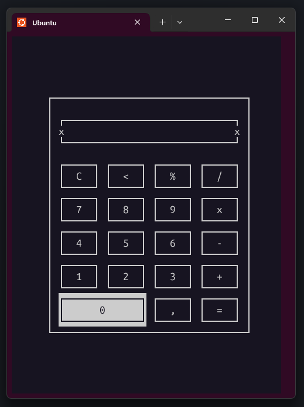

# 🧮 Interactive Calculator - C Language

Modern and robust interactive calculator with terminal-based GUI using NCurses library.

[🇺🇸 English Version](README.md) | [🇧🇷 Versão em Português](PT-BR-README.md)


<br>

<p align="center">
  <!-- Add your project preview image below -->
  
</p>

<br>

## 📋 Table of Contents

* [About](#-about)
* [Technologies Used](#-technologies-used)
* [How to Run](#-how-to-run)
* [License](#-license)
* [Contact](#-contact)

<br>

## 📖 About

**Interactive Calculator in C** is a terminal-based calculator application developed as part of a college course project. It features an interactive user interface implemented using the NCurses library, providing a graphical calculator experience in the terminal environment.

**Key features:**
*   **Graphical Interface (NCurses):** Interactive terminal interface with visual buttons and display.
*   **Mathematical Operations:** Addition, subtraction, multiplication, and division.
*   **User Input Control:** Keyboard event handling for user interaction.
*   **Input Validation:** Ensures operation validity and prevents errors.
*   **Screen Management:** Clear screen and delete last character functionality.
*   **Modular Structure:** Well-organized code with specific functions for different aspects.
*   **Memory Management:** Dynamic memory allocation and string manipulation.

<br>

## 💻 Technologies Used

- C Programming Language
- NCurses Library
- Linux Terminal
- Dynamic Memory Allocation
- String Manipulation

<br>

## 🛡️ Robustness and Best Practices

- The system uses dynamic memory allocation to manage strings and data.
- Input validation ensures valid mathematical operations.
- Error handling for memory allocation failures.
- Modular interface with specific functions for different features.
- Terminal color support when available.

## 🚀 How to Run

```bash
# Clone this repository
$ git clone https://github.com/gabrielcamarate/Calculadora-Interativa.git

# Enter the project folder
$ cd Calculadora-Interativa

# Compile the project
$ make
```

To run the calculator:

```bash
./calculadora
```

To clean compiled files:

```bash
make clean
```

> **Note:** This calculator is currently functional only for Linux terminal. Windows terminal version is in development.

<br>

## 📝 License

This project is private and for restricted use. Distribution, modification, or commercial use is not permitted without explicit authorization from the author.

<br>

## 📬 Contact

Made with ❤️ by Gabriel Camarate. Get in touch!

[](https://www.linkedin.com/in/gabrielcamarate/)
[](mailto:gabrielcamarate@icloud.com)
[](https://github.com/gabrielcamarate)
